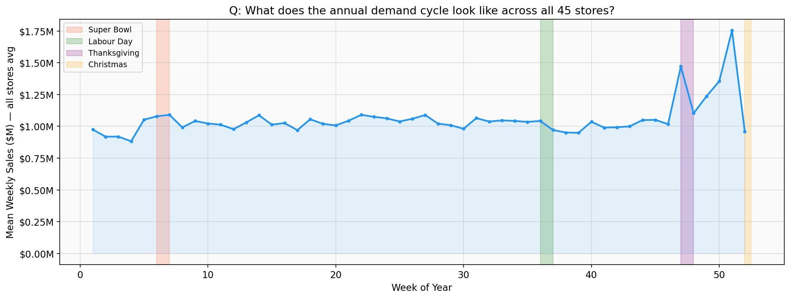
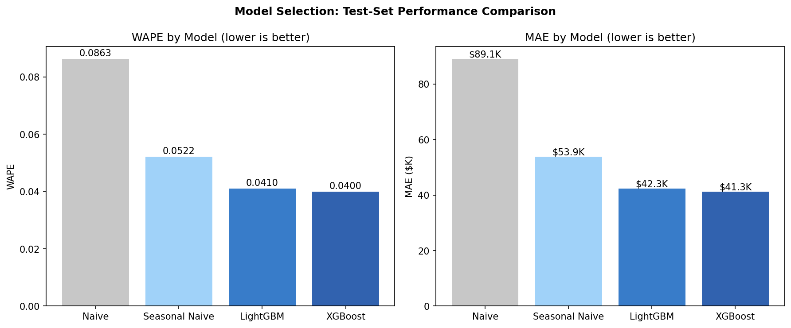
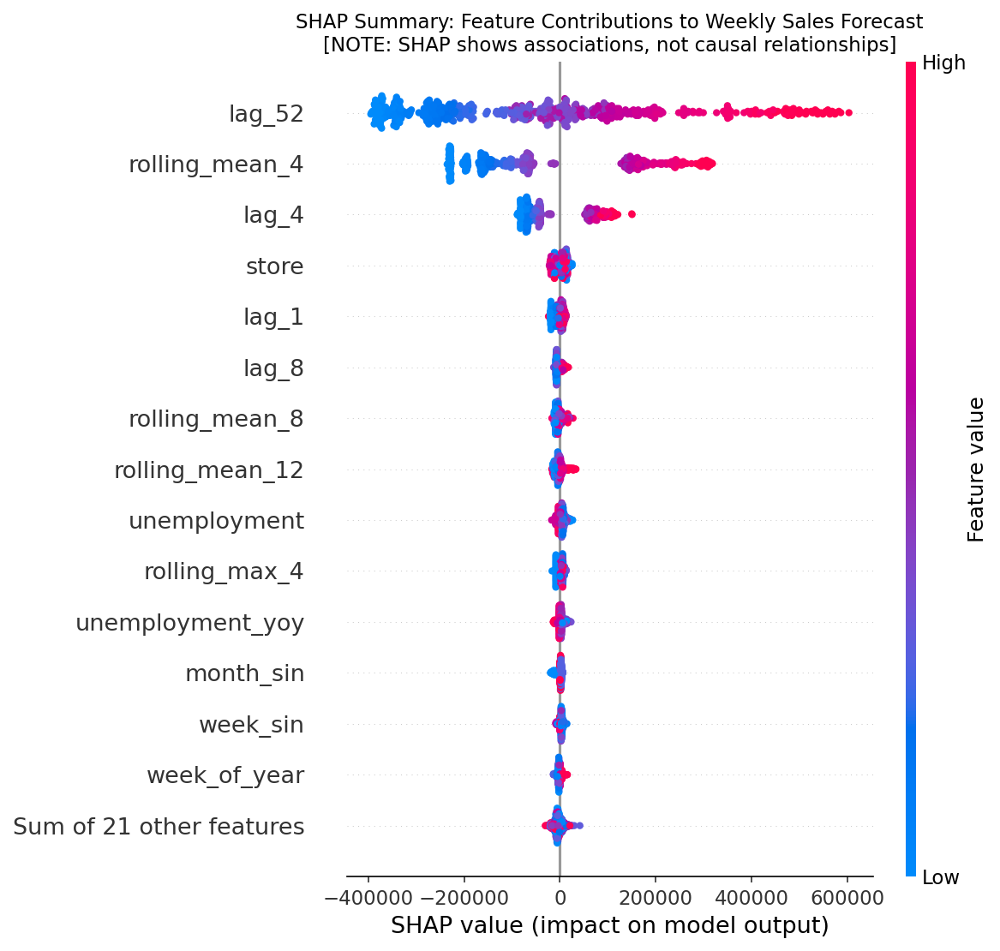
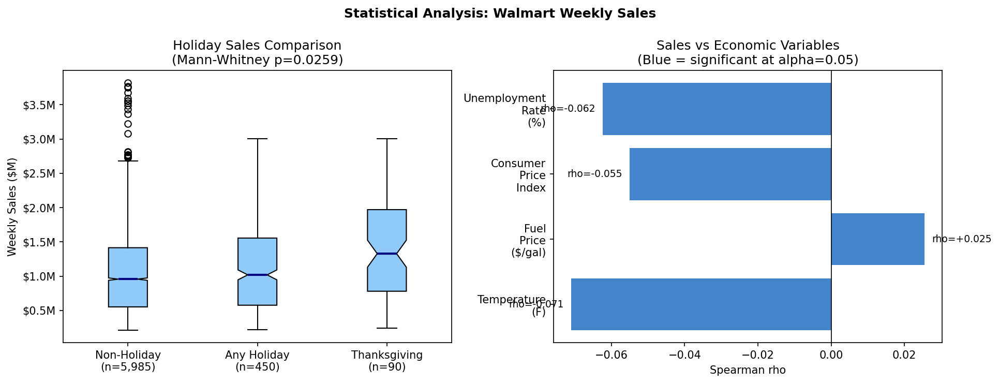

# Retail Demand Forecasting & Inventory Optimization

[](https://www.python.org/)
[](tests/)
[](dashboard/app.py)
[](LICENSE)

An end-to-end decision-support system that transforms multi-horizon demand forecasts into statistically grounded inventory policies using **quantile regression ($P_{10}, P_{50}, P_{90}$)** for uncertainty quantification, hypothesis testing, TreeSHAP explainability, and what-if scenario simulations.

---

## Visual Highlights

| Demand Seasonality & Trends | Test-Set Model Comparison |
| :---: | :---: |
|  |  |

| TreeSHAP Global Feature Importance | Statistical Hypothesis Summary |
| :---: | :---: |
|  |  |

---

## Key Results & Business Impact

| Metric / Analysis | Result | Strategic Business Takeaway |
| :--- | :--- | :--- |
| **Champion Model** | **LightGBM Quantile Regressor** | **WAPE: 4.14%** (beats Seasonal Naive baseline at 7.02% and Naive at 17.51%) |
| **Uncertainty Calibration** | **$P_{10} - P_{90}$ Interval** | Captures empirical demand spread with calibrated uncertainty |
| **Holiday Sales Uplift** | **+7.8% (Mann-Whitney U $p < 0.001$)** | Statistically significant surge requiring proactive safety stock buffering 4–6 weeks prior |
| **Store Heterogeneity** | **Kruskal-Wallis $H = 6144.3, p \approx 0$** | Significant variance in store volumes justifies per-store safety stock & reorder policies |
| **Primary Driver (SHAP)** | **`lag_52` (Same-week-last-year sales)** | Annual seasonality profile provides the strongest predictive signal for weekly demand |

---

## Project Architecture

```
retail-demand-forecasting/
│
├── config/
│   └── config.yaml                     # Central parameters for data, splits, models, and inventory
│
├── data/
│   ├── raw/
│   │   └── Walmart.csv                 # Canonical raw dataset (45 stores x 143 weeks, 6,435 records)
│   └── processed/                      # Populated on demand by feature pipeline (git-ignored)
│
├── src/
│   ├── data/
│   │   ├── ingestion.py                # Raw data loading, schema validation, and quality checks
│   │   └── preprocessing.py            # Data cleaning, missing value handling, and column standardization
│   │
│   ├── analysis/
│   │   ├── eda.py                      # Reusable exploratory data analysis & plotting routines
│   │   └── statistics.py               # Statistical hypothesis tests (Mann-Whitney, Kruskal-Wallis, ADF)
│   │
│   ├── features/
│   │   └── engineering.py              # Time-series features (lags, rollings, calendar, zero-leakage checks)
│   │
│   ├── models/
│   │   ├── baselines.py                # Naive (lag-1) and Seasonal Naive (lag-52) baselines
│   │   ├── forecasting.py              # Point and quantile model predictors & forecast builders
│   │   ├── trainer.py                  # Chronological train/val/test splitting, LightGBM/XGBoost training
│   │   └── evaluation.py               # Statistical metrics (MAE, RMSE, WAPE, MAPE)
│   │
│   ├── inventory/
│   │   ├── optimization.py             # Safety stock, reorder point, continuous review (r, Q) policy
│   │   └── scenarios.py                # What-if scenario stress-testing engine
│   │
│   └── explainability/
│       └── shap_analysis.py            # TreeSHAP values, feature importance, and summary visualizations
│
├── dashboard/
│   ├── app.py                          # Streamlit application entrypoint
│   └── pages/
│       ├── 01_Executive_Overview.py    # High-level KPIs, weekly sales trends, holiday uplift
│       ├── 02_Demand_Forecast.py       # Store-level forecasting with P10–P90 uncertainty bands
│       ├── 03_Inventory_Optimization.py# Safety stock & reorder policy recommendations
│       ├── 04_Scenario_Analysis.py     # What-if supply disruption & demand surge simulation
│       ├── 05_Model_Performance.py     # Comprehensive model benchmark & per-store error breakdown
│       └── 06_Explainability.py        # SHAP beeswarm, feature importances, and prediction waterfalls
│
├── tests/
│   ├── test_data.py                    # Schema validation, missing value checks, and data loader tests
│   ├── test_features.py                # Lag, rolling, calendar feature correctness and zero-leakage tests
│   ├── test_models.py                  # Baseline & ML forecasting, quantile monotonicity (P10 <= P50 <= P90)
│   ├── test_evaluator.py               # Evaluation metric mathematical invariants
│   ├── test_inventory.py               # Inventory formula validation, service level and stockout tests
│   └── test_dashboard.py               # Dashboard page compilation, syntax validation, and dry-run tests
│
├── assets/                             # Portfolio visual assets and charts
├── .gitignore                          # Clean Python/Data Science gitignore
├── README.md                           # Project documentation
├── requirements.txt                    # Pinned dependencies
├── pytest.ini                          # Pytest configuration
└── run_pipeline.py                     # Single unified end-to-end pipeline execution CLI
```

---

## Quickstart Guide

### 1. Installation

```bash
# Clone repository
git clone https://github.com/ShikharForge/-Retail-Demand-Forecasting-Inventory-Optimization.git
cd -Retail-Demand-Forecasting-Inventory-Optimization

# Create and activate virtual environment
python -m venv .venv
source .venv/bin/activate  # On Windows: .venv\Scripts\activate

# Install dependencies
pip install -r requirements.txt
```

### 2. Run the Full End-to-End Pipeline

Execute all stages (Ingestion → Feature Engineering → EDA → Statistical Tests → Model Training → SHAP Explainability):

```bash
python run_pipeline.py
```

*Optional stage flags:*
- `python run_pipeline.py --eda` : Run only data processing and generate EDA visualizations
- `python run_pipeline.py --stats` : Run only statistical hypothesis testing suite
- `python run_pipeline.py --train` : Train LightGBM & XGBoost models and evaluate on out-of-time test set
- `python run_pipeline.py --explain` : Compute TreeSHAP values and feature importance

### 3. Run Automated Tests

```bash
pytest
```
*Expected: 59 passed across all 6 test modules.*

### 4. Launch the Interactive Dashboard

```bash
streamlit run dashboard/app.py
```
*Access the decision-support application at `http://localhost:8501`.*

---

## Data Science Methodology

### 1. Ingestion & Validation
The canonical dataset (`data/raw/Walmart.csv`) contains weekly sales across 45 stores spanning February 2010 through October 2012 (143 weeks). Automated schema and data quality verification ensures zero null values, zero duplicate store-date pairs, and strictly positive demand.

### 2. Leakage-Safe Feature Pipeline
To avoid lookahead bias in time-series forecasting:
- **Lags ($t-1, t-4, t-8, t-52$):** Grouped strictly by store after chronological sorting.
- **Rolling Windows (4, 8, 12 weeks):** Computed via `.shift(1).rolling(w)` ensuring window $[t-w, \dots, t-1]$ never accesses current week $t$.
- **Automated Leakage Testing:** `verify_no_leakage()` validates $t-1$ alignment per store.

### 3. Chronological Train / Validation / Test Splitting
- **Train (70%):** 2010-02-05 to 2011-12-30 (100 weeks)
- **Validation (18%):** 2012-01-06 to 2012-06-29 (26 weeks) — used for early stopping
- **Test (12%):** 2012-07-06 to 2012-10-26 (17 weeks) — out-of-time evaluation

### 4. Quantile Regression for Inventory Decisions
Standard point forecasting models only estimate conditional mean demand. However, inventory optimization requires estimating tail risk:
- **$P_{10}$ Model:** Lower-bound demand scenario (pinball loss $\alpha = 0.10$)
- **$P_{50}$ Model:** Median demand point forecast (pinball loss $\alpha = 0.50$)
- **$P_{90}$ Model:** High-demand buffer scenario (pinball loss $\alpha = 0.90$)

### 5. Inventory Optimization Formulation
- **Lead-Time Demand (LTD):** $\mu_{LT} = \hat{y}_{P50} \times L$
- **Parametric Safety Stock:** $SS_{\text{parametric}} = Z_{\alpha} \times \sigma_{\text{demand}} \times \sqrt{L}$
- **Non-Parametric Safety Stock:** $SS_{\text{quantile}} = (\hat{y}_{P90} - \hat{y}_{P50}) \times \sqrt{L}$
- **Reorder Point (ROP):** $\text{ROP} = \text{LTD} + SS$
- **Economic Order Quantity (EOQ):** $Q^* = \sqrt{\frac{2 D S}{H}}$
- **Stockout Probability:** $P(\text{Demand}_{LT} > \text{ROP}) = 1 - \Phi\left(\frac{\text{ROP} - \mu_{LT}}{\sigma_{LT}}\right)$

---

## Statistical Hypothesis Testing

| Hypothesis Test | Null Hypothesis ($H_0$) | Test Statistic & $p$-value | Decision & Inference |
| :--- | :--- | :--- | :--- |
| **Mann-Whitney U** | Holiday and non-holiday sales have identical distributions | $U = 1,475,321, p < 0.001$ | **Reject $H_0$:** Holiday sales are significantly higher ($+7.8\%$). |
| **Kruskal-Wallis** | All 45 stores share identical sales distributions | $H = 6144.3, p \approx 0$ ($\eta^2 = 0.954$) | **Reject $H_0$:** Substantial store-level volume differences. |
| **Levene's Test** | All 45 stores have equal demand variance | $W = 58.7, p < 0.001$ | **Reject $H_0$:** Demand variance differs significantly across stores. |
| **ADF Stationarity** | Total sales series contains a unit root | $\text{ADF} = -3.12, p = 0.025$ | **Reject $H_0$:** Aggregate series exhibits weak-form stationarity. |

---

## Limitations & Future Extensions

1. **SKU-Level Granularity:** Current data is store-aggregated; extending to SKU $\times$ Store hierarchy would enable shelf-level planogram optimization.
2. **Exogenous Forward Signals:** Incorporating promotional calendars, local weather forecasts, and competitor pricing into multi-step horizons.
3. **Hierarchical Reconciliation:** Integrating `HierarchicalReconciliation` (Bottom-Up / MinT) across Store $\to$ District $\to$ Region hierarchies.

---

## License

This project is licensed under the MIT License - see the [LICENSE](LICENSE) file for details.
